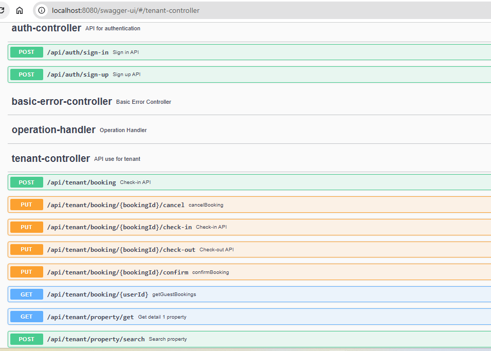

# Airbnb booking app

Restful API Documentation

List of API
 1. /api/auth/sign-in
 2. /api/auth/sign-up
 3. /api/tenant/property/search ( search properties for booking)
 4. /api/tenant/property/get 
 5. /api/tenant/booking 
 6. /api/tenant/booking/{bookingId}/confirm
 7. /api/tenant/booking/{bookingId}/check-in
 8. /api/tenant/booking/{bookingId}/check-out
 9. /api/tenant/booking/{bookingId}/cancel
10. /api/tenant/booking/{userId} ( get all booking for an logged in user)

Update mysql connection setting inside file spring-airbnb/src/main/resources/application.yml

Choose either way below to start app
1. If your company has already installed mvn already then 
    Run this project and this command : `mvn clean spring-boot:run`
    Open your browser :
    `http://localhost:8080/swagger-ui.html`
2. Run build.bat -> copy war file into external tomcat and start tomcat
    Open your browser:
   `http://localhost:8080/airbnb-0.0.1/swagger-ui.html`

You'll see the list of APIs   

